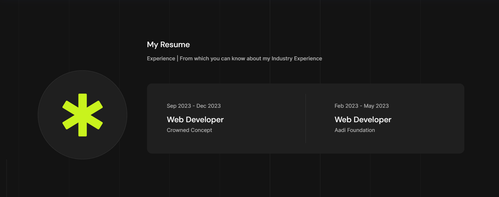

# Anjali Pal - Software Development Portfolio

Hello, I'm Anjali Pal, a passionate and dedicated BCA student at SNDT University in Mumbai. I specialize in web development, with proficiency in HTML, CSS, JavaScript, Node.js, and basic backend technologies.

## Table of Contents

- [Hire Me](#hire-me)
- [About Me](#about-me)
- [Experience](#experience)
- [Services](#services)
- [Skills](#skills)
- [Latest Works](#latest-works)
- [Testimonials](#clients-testimonials)
- [Get In Touch](#get-in-touch)

## Hire Me

- [Download Resume](#) <!-- Add the actual link to your resume -->

**Years Of Experience:** 1  
**Projects Completed:** 8  
**Client Satisfactions:** 99  

## About Me

Hello! I am Anjali Pal, currently pursuing a BCA course at SNDT University in Mumbai. I am passionate about technology and specialize in creating digital solutions. With a strong foundation in HTML, CSS, JavaScript, Node.js, and backend technologies, I bring a comprehensive skill set to the table.

### Experience

#### Web Developer at Crowned Concept
- **Duration:** Sep 2023 - Dec 2023

#### Web Developer at Aadi Foundation
- **Duration:** Feb 2023 - May 2023

## Services

**My Special Services For your Business Development:**
1. Branding
2. Website Design
3. UI/UX Designer
4. Android Development

## Skills

I take pride in my diverse skill set, combining technical expertise with creative problem-solving. Here's a glimpse into the skills and experiences I bring to the table:

- Figma: 95%
- Photoshop: 56%
- Wordpress: 84%
- Python: 62%
- Sketch: 44%
- Prompt Engineering: 80%
- JavaScript: 56%
- Flutter: 75%

## Latest Works

### Project: Website Makeup Design
- **Development/Technical:** Use to create creative Websites using HTML, CSS, JS, React.js, Node.js, Three.js, and for Backend I use a bit SQL & Azure(Microsoft)

### Project: Brand Identity and Motion Design
- **UI/UX Design:** Have good knowledge of Branding and Use to do On figma and Adobe XD. Also Have the knowledge of Branding Research

### Project: Mobile Application Development
- **Development:** Use to Design and Code application Using Flutter and Dart as a language for developing

## Clients Testimonials

I’ve received positive feedback from my previous organization. Got a Testimonial from my previous organization.

## Get In Touch

**Address:** Navi Mumbai  
**Email:** directtoanjali@gmail.com  
**Phone:** +919372116535
